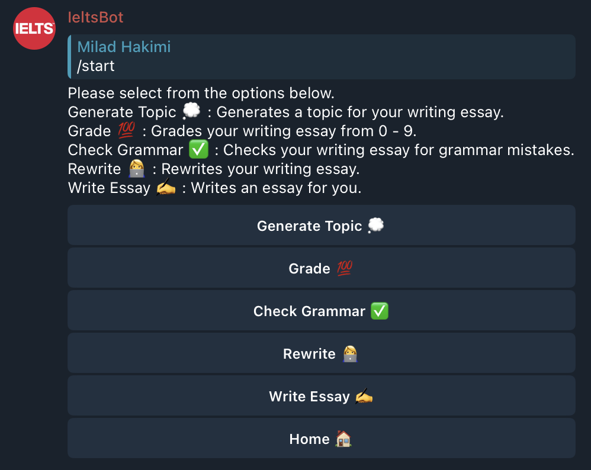

# IELTS Grader

IELTS Grader is a tool to help you grade your IELTS writing and speaking tests. Moreover, it tests your vocabulary knowledge by sending you challenging words to learn. It relies on ChatGPT to grade your writings, speakings, and send you the words to learn.

IELTS Grader is built as a Telegram bot. To use it, you can either use a live version of a Telegram bot I made at @english_teacher01_bot or create a Telegram bot and use its token to run the code locally or on a server.

Here is a list of tasks that it can do:
- Reading: 
    - Vocabulary: Teaches you a new word or asks you from the words you have already seen.
- Writing:
  - Generates topic for writing.
  - Grades your writing.
  - Checks grammar.
  - Rewrites your writing with better words, grammar, and structure.
  - Generates a writing based on a given topic.
- Speaking:
  - Generates topic for speaking.
  - Grades your speaking.
  - Generates a speaking manuscript based on a given topic.

Photos of the bot in action:
Reading | Writing | Speaking
:-------------------------:|:-------------------------:|:-------------------------:
 |  | 
## How to Install
### Requirements
- Python 3.6+
- ChatGPT API key
- Telegram bot token
- Google Cloud API key (for speech recognition and online storage of the recordings)
- SQLAlchemy database (for storing the words and users)

1. Clone the repository:
```
git clone git@github.com:miladHakimi/ielts-grader.git
```
2. Install the requirements:
```
pip install -r requirements.txt
```
3. Create a `.env` file in the root directory of the project and add the following variables to it:
```bash
export BOT_TOKEN=<Telegram bot token>
export OPENAI_API_KEY=<ChatGPT API key>
export PRIVATE_GROUP_ID=<Telegram adming groud ID>
export DB_NAME=<Database name>
export GOOGLE_API_KEY_DIR=<Google API key directory on your machine>
export GOOGLE_API_KEY=<Google API key>
export BUCKET_NAME=<Google Cloud bucket name>
```
## How to run
1. Source the `.env` file:
```
source .env
```
2. Run the bot:
```
python3 bot.py
```


Run the tests using the following command:
```
python -m unittest
```
